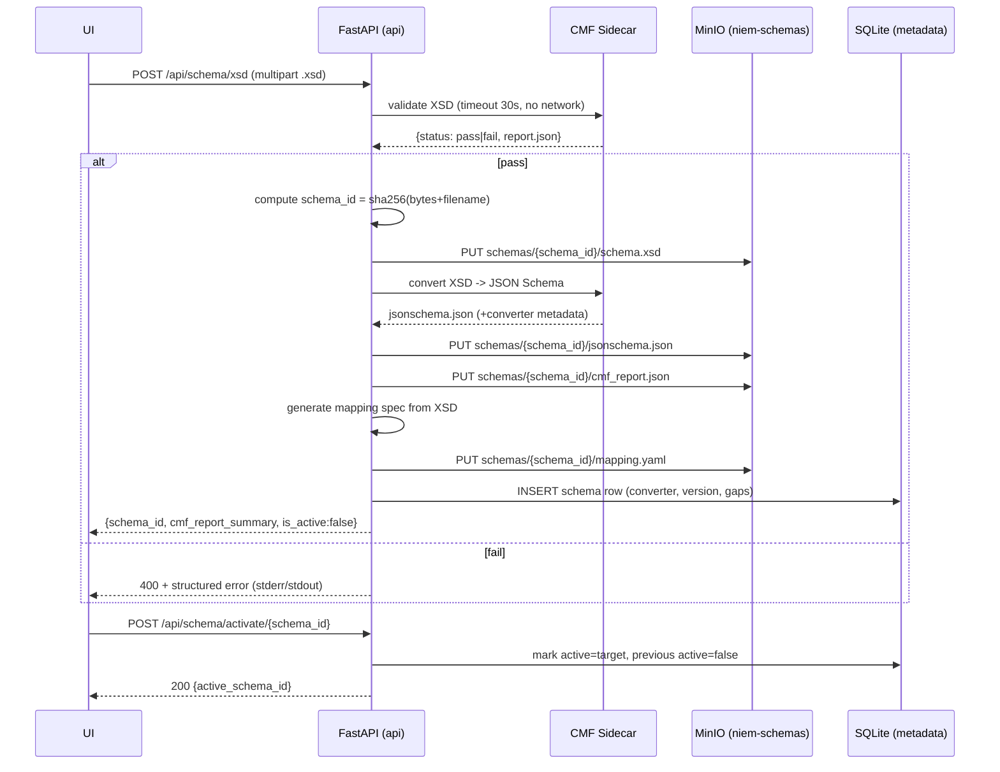
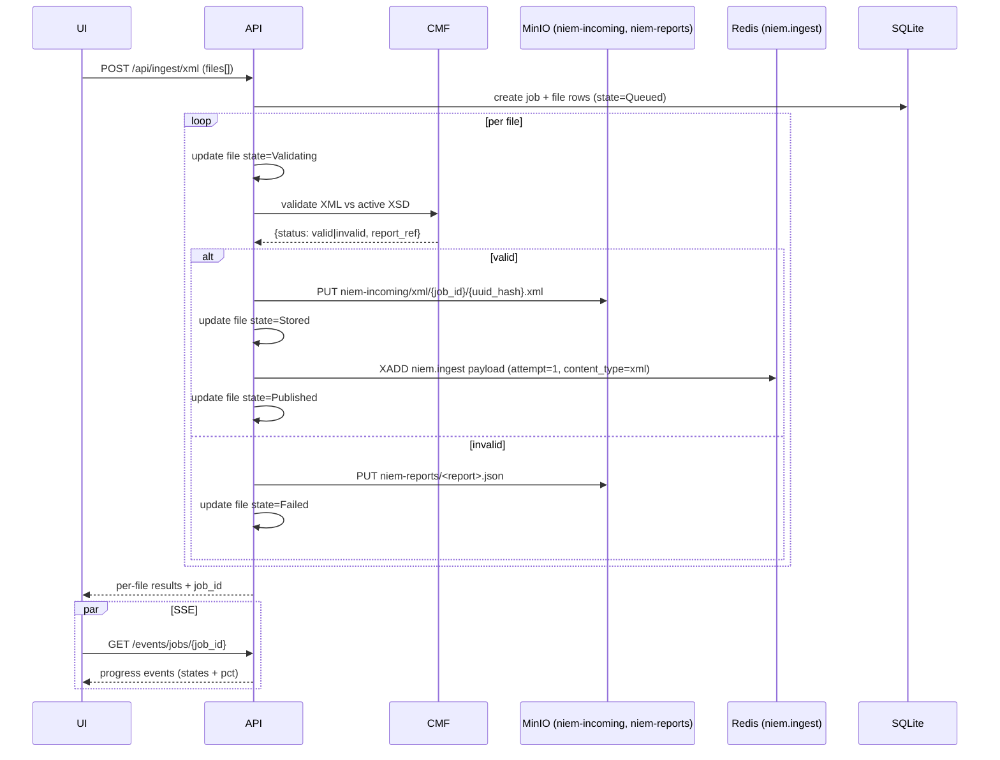
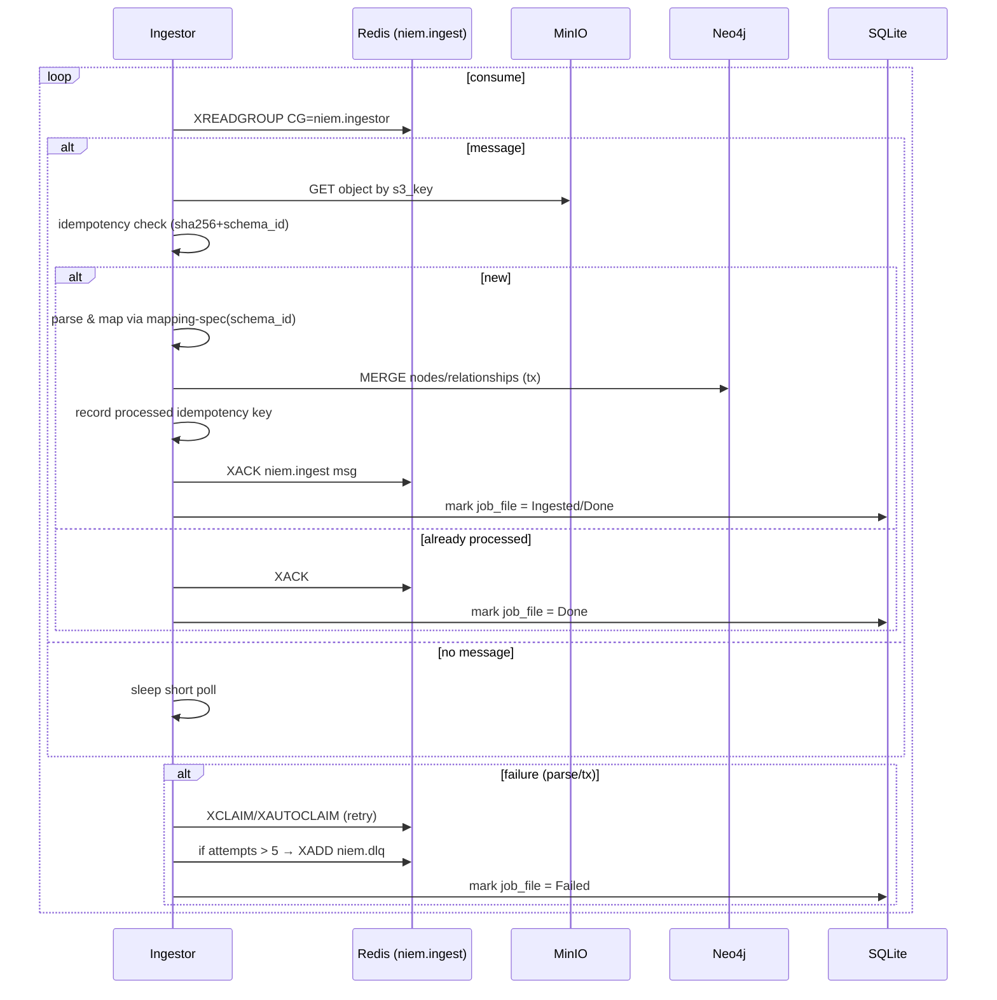
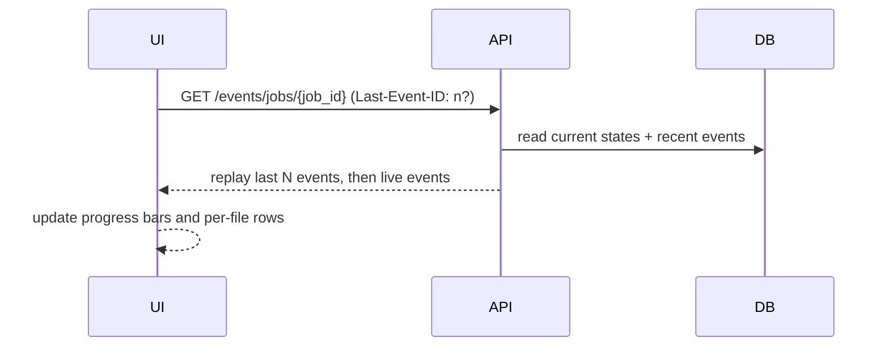
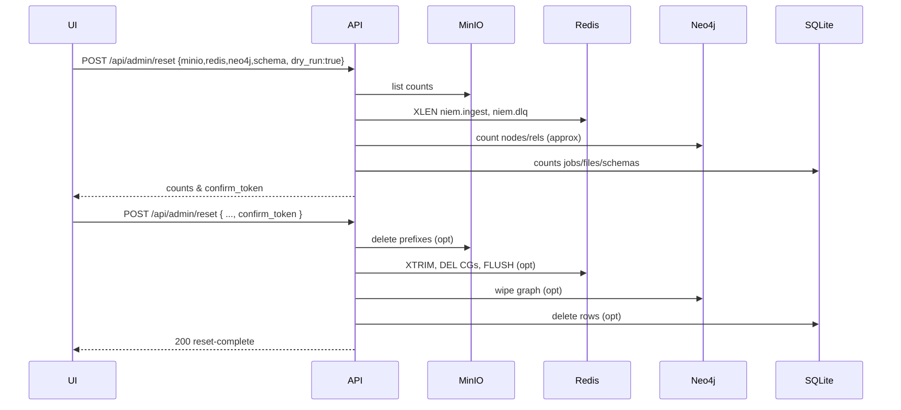

# NIEM Demo & Proof-of-Concept — Detailed Technical Design

*Last updated: Sep 18, 2025*

---

# 0) High-level components
- **UI**: Next.js app (SSE client, upload UX, graph viewer).
- **API** (`api`): FastAPI for schema mgmt, validation orchestration, uploads, job tracking, SSE.
- **Worker** (`ingestor`): FastAPI (or headless Python) service consuming Redis Streams and writing to Neo4j.
- **CMF Sidecar** (`cmf`): Java CMF tool invoked via `subprocess` behind a slim HTTP shim or through a shared volume.
- **Redis**: Streams + consumer groups; DLQ stream.
- **MinIO**: S3-compatible object store (local buckets).
- **Neo4j**: Graph DB with APOC.
- **SQLite** (or Postgres): lightweight metadata store for jobs/schemas (PoC: SQLite file mounted in `api`).

---


---

# Design Decision (Update)
**Mapping spec generation timing**: The **mapping spec is auto-generated during schema upload/activation**.  
- On successful XSD validation and JSON Schema conversion, the API will:
  1) **Generate a mapping spec** from the XSD (`mapping/{schema_id}.yaml`) using the XSD→Graph rules.
  2) **Persist** it to object storage alongside the schema artifacts.
  3) **Optionally emit Cypher DDL** to create/update Neo4j constraints/indexes upon activation.
- The mapping spec is **versioned per `schema_id`** and used by the worker for ingestion.

# 1) Core flows (sequence diagrams)

## 1.1 Schema upload & activation


## 1.2 XML ingest (validate → store → publish)


## 1.3 JSON ingest (validate using generated JSON Schema)
```mermaid
sequenceDiagram
  participant UI
  participant API
  participant S3 as MinIO
  participant Q as Redis (niem.ingest)
  participant DB as SQLite

  UI->>API: POST /api/ingest/json (files[])
  API->>DB: create job + file rows (Queued)
  loop per file
    API->>API: validate JSON vs jsonschema.json (strict or best-effort)
    alt valid
      API->>S3: PUT niem-incoming/json/{job_id}/{uuid_hash}.json
      API->>API: update file=Stored
      API->>Q: XADD niem.ingest (attempt=1, content_type=json)
      API->>API: update file=Published
    else invalid
      API->>API: update file=Failed
  end
  API-->>UI: results + job_id
```

## 1.4 Worker consumption → Neo4j upsert (with retries/DLQ)


## 1.5 SSE progress + reconnect


## 1.6 Admin reset (dry-run + confirm token)


---

# 2) Data models (SQLite, PoC)
**schemas**
- schema_id (PK)
- filename
- uploaded_at
- active (bool)
- converter
- converter_version
- known_gaps

**jobs**
- job_id (PK)
- created_at
- created_by
- schema_id
- status
- overall_pct

**job_files**
- file_id (PK)
- job_id (FK)
- filename
- content_type
- size_bytes
- checksum_sha256
- s3_key
- state
- attempts
- started_at / finished_at
- report_ref

**events**
- event_id (PK)
- job_id
- seq
- payload (json)
- created_at

---

# 3) Mapping spec (YAML)
```yaml
version: 1
indexes:
  - label: Person
    properties: [personId]
nodes:
  - label: Person
    match_on: [nc:PersonID]
    props:
      - name: fullName
        from: nc:PersonName/nc:PersonFullName
      - name: birthDate
        from: nc:PersonBirthDate/nc:Date
  - label: Crash
    match_on: [j:Crash/j:CrashNumber]
    props:
      - name: activityDate
        from: nc:ActivityDate/nc:Date
relationships:
  - type: INVOLVED_IN
    from_label: Person
    to_label: Crash
    via_path: j:Crash/j:CrashDriver
    match:
      from: nc:PersonID
      to: j:Crash/j:CrashNumber
```

---

# 4) API contracts (selected)
- POST /api/schema/xsd
- POST /api/schema/activate/{schema_id}
- GET /api/schema
- POST /api/ingest/xml
- POST /api/ingest/json
- GET /api/jobs, GET /api/jobs/{id}
- GET /events/jobs/{job_id} (SSE)
- POST /api/admin/reset

All writes require `Authorization: Bearer <DEV_TOKEN>`.

---

# 5) Docker on MacBook Air (Apple Silicon)

Compose stack with multi-arch images, healthchecks, log rotation, and seeded services.

```yaml
version: "3.9"

x-logging: &default-logging
  driver: "json-file"
  options:
    max-size: "100m"
    max-file: "5"

services:
  redis:
    image: redis:7-alpine
    command: ["redis-server", "--appendonly", "no"]
    ports: ["6379:6379"]
    healthcheck:
      test: ["CMD", "redis-cli", "PING"]
      interval: 5s
      timeout: 2s
      retries: 20
    logging: *default-logging

  minio:
    image: quay.io/minio/minio:RELEASE.2025-02-28T00-00-00Z
    command: ["server", "/data", "--console-address", ":9001"]
    environment:
      MINIO_ROOT_USER: ${MINIO_ROOT_USER:-minio}
      MINIO_ROOT_PASSWORD: ${MINIO_ROOT_PASSWORD:-minio123}
    ports: ["9000:9000", "9001:9001"]
    volumes:
      - minio-data:/data
    healthcheck:
      test: ["CMD", "curl", "-f", "http://localhost:9000/minio/health/live"]
      interval: 5s
      timeout: 3s
      retries: 30
    logging: *default-logging

  neo4j:
    image: neo4j:5.20-community
    environment:
      NEO4J_AUTH: neo4j/${NEO4J_PASSWORD:-password}
      NEO4J_dbms_security_procedures_unrestricted: "apoc.*"
      NEO4J_PLUGINS: '["apoc"]'
    ports: ["7474:7474", "7687:7687"]
    volumes:
      - neo4j-data:/data
    healthcheck:
      test: ["CMD-SHELL", "cypher-shell -u neo4j -p ${NEO4J_PASSWORD:-password} 'RETURN 1' || exit 1"]
      interval: 10s
      timeout: 5s
      retries: 20
    logging: *default-logging

  cmf:
    build:
      context: ./services/cmf
      dockerfile: Dockerfile
    # HTTP shim or use shared volume handoff with API
    environment:
      JAVA_TOOL_OPTIONS: "-Xms128m -Xmx512m"
    healthcheck:
      test: ["CMD", "curl", "-f", "http://localhost:8080/healthz"]
      interval: 10s
      timeout: 3s
      retries: 20
    logging: *default-logging

  api:
    build:
      context: ./services/api
      dockerfile: Dockerfile
    environment:
      DEV_TOKEN: ${DEV_TOKEN:-devtoken}
      REDIS_URL: redis://redis:6379
      MINIO_ENDPOINT: http://minio:9000
      MINIO_ACCESS_KEY: ${MINIO_ROOT_USER:-minio}
      MINIO_SECRET_KEY: ${MINIO_ROOT_PASSWORD:-minio123}
      MINIO_REGION: us-east-1
      MINIO_SECURE: "false"
      NEO4J_URI: bolt://neo4j:7687
      NEO4J_USER: neo4j
      NEO4J_PASSWORD: ${NEO4J_PASSWORD:-password}
      SQLITE_PATH: /data/meta.sqlite
      CMF_URL: http://cmf:8080
    volumes:
      - api-data:/data
    ports: ["8000:8000"]
    depends_on:
      redis:
        condition: service_healthy
      minio:
        condition: service_healthy
      neo4j:
        condition: service_healthy
      cmf:
        condition: service_healthy
    healthcheck:
      test: ["CMD", "curl", "-f", "http://localhost:8000/readyz"]
      interval: 5s
      timeout: 3s
      retries: 30
    logging: *default-logging

  ingestor:
    build:
      context: ./services/ingestor
    environment:
      REDIS_URL: redis://redis:6379
      MINIO_ENDPOINT: http://minio:9000
      MINIO_ACCESS_KEY: ${MINIO_ROOT_USER:-minio}
      MINIO_SECRET_KEY: ${MINIO_ROOT_PASSWORD:-minio123}
      NEO4J_URI: bolt://neo4j:7687
      NEO4J_USER: neo4j
      NEO4J_PASSWORD: ${NEO4J_PASSWORD:-password}
      STREAM_NAME: niem.ingest
      CONSUMER_GROUP: niem.ingestor
      DLQ_STREAM: niem.dlq
      MAX_RETRIES: "5"
    depends_on:
      api:
        condition: service_healthy
    healthcheck:
      test: ["CMD", "curl", "-f", "http://localhost:7000/readyz"]
      interval: 10s
      timeout: 3s
      retries: 20
    logging: *default-logging

volumes:
  minio-data:
  neo4j-data:
  api-data:
```

## 5.2 Seed tasks (run once on API start)
	•	Create MinIO buckets: niem-schemas, niem-incoming, niem-reports, niem-graph-exports.
	•	Create Redis CG: XGROUP CREATE niem.ingest niem.ingestor $ MKSTREAM.
	•	Create Neo4j constraints from mapping spec (on the first activation).
---

# 6) Repo design
```
niem-poc/
├─ README.md
├─ .env.example
├─ docker-compose.yml
├─ scripts/
│  ├─ seed_minio.py
│  ├─ seed_redis.sh
│  ├─ seed_neo4j.cypher
│  └─ bench_run.sh
├─ tools/
│  ├─ gen_dataset.py          # synthetic XML/JSON generator
│  └─ bench_client.py         # pushes files, measures throughput/latency
├─ services/
│  ├─ api/
│  │  ├─ Dockerfile
│  │  ├─ app/
│  │  │  ├─ main.py           # FastAPI, routes, SSE
│  │  │  ├─ deps.py
│  │  │  ├─ models.py         # Pydantic + SQLAlchemy models
│  │  │  ├─ db.py             # SQLite init/migrations
│  │  │  ├─ s3.py             # MinIO client
│  │  │  ├─ redisx.py         # stream producer
│  │  │  ├─ cmf.py            # sidecar client (validate/convert)
│  │  │  ├─ auth.py           # dev token check
│  │  │  ├─ sse.py            # event emitter
│  │  │  └─ logging_conf.py
│  │  └─ requirements.txt
│  ├─ ingestor/
│  │  ├─ Dockerfile
│  │  └─ app/
│  │     ├─ main.py           # /healthz /readyz
│  │     ├─ worker.py         # consumer loop
│  │     ├─ mapping_loader.py
│  │     ├─ neo4j_client.py
│  │     ├─ s3_client.py
│  │     ├─ redis_client.py
│  │     └─ logging_conf.py
│  └─ cmf/
│     ├─ Dockerfile           # openjdk-jre + CMF jar + tiny HTTP shim
│     └─ server.sh            # invokes jar; disables XXE; 30s timeout
├─ ui/
│  ├─ package.json
│  ├─ next.config.js
│  └─ src/
│     ├─ pages/
│     ├─ components/
│     │  ├─ SchemaManager.tsx
│     │  ├─ UploadPanel.tsx
│     │  ├─ JobsTable.tsx
│     │  ├─ GraphExplorer.tsx
│     │  └─ ProgressSSE.tsx
│     └─ lib/sse.ts
├─ mapping/
│  └─ default.yaml
└─ prd.md
```

---

# 7) Service implementation notes
## 7.1 **API**: FastAPI, JSON logs, SSE, MinIO, Redis, SQLite, CMF sidecar client.
	•	Logging: JSON to STDOUT (python-json-logger), includes trace_id, job_id, file_id, schema_id.
	•	SSE: use starlette.responses.EventSourceResponse; keep payloads < 20KB; support Last-Event-ID.
	•	Validation:
	•	XML: POST to cmf sidecar /validate/xml with schema pointer; enforce timeout + no XXE.
	•	JSON: use jsonschema lib against jsonschema.json (strict flag configurable).
	•	MinIO: boto3 or minio Python SDK; write with checksum (sha256); verify Content-Length.
	•	Redis: redis-py with XADD to niem.ingest; payload includes attempt=1.
	•	SQLite: sqlalchemy models; DB lives on /data/meta.sqlite volume.
## 7.2 **Worker (Ingestor)**: Redis consumer, idempotency checks, Neo4j MERGE, retry/DLQ.
	•	Loop: XREADGROUP BLOCK 2000 COUNT 10; XAUTOCLAIM for stuck messages.
	•	Idempotency: store processed keys in Redis SET processed:<schema_id> or as a small Neo4j index node; choose Redis for PoC speed.
	•	Neo4j:
	•	Use official Python driver; wrap MERGE ops in a single transaction per file.
	•	On schema activation, build constraints from mapping spec (e.g., CREATE CONSTRAINT person_id IF NOT EXISTS ...).
	•	Retry/DLQ: increment attempt in payload; if attempt > MAX_RETRIES → XADD niem.dlq and XACK original.
##7.3 **CMF**: Java sidecar with HTTP shim, disables XXE.
	•	Image: eclipse-temurin:21-jre + CMF jar.
	•	HTTP shim: Minimal server (e.g., micronaut/sparkjava or Python Flask + subprocess) with routes:
	•	POST /validate/xsd
	•	POST /validate/xml
	•	POST /convert/xsd-to-jsonschema
	•	Safety: disable external entity resolution; restrict file paths; cap memory; 30s per operation.

---

# 8) Observability
- Prom metrics: validation duration, ingest events total, stream lag, minio failures, neo4j tx duration.
- Logs: JSON with rotation.
- Healthz & readyz endpoints.

---

# 9) Performance & Bench
- Dataset generator, benchmark scripts, throughput/latency CSVs.

---

# 10) Security
- Dev token auth for writes.
- File size caps, XXE disabled, non-root containers.

---

# 11) Done checklist
- Compose up runs.
- Healthchecks pass.
- Upload/activate schemas.
- XML/JSON validated + published.
- Worker ingests idempotently.
- SSE progress reliable.
- Admin reset functional.
- Bench run documented.

---
