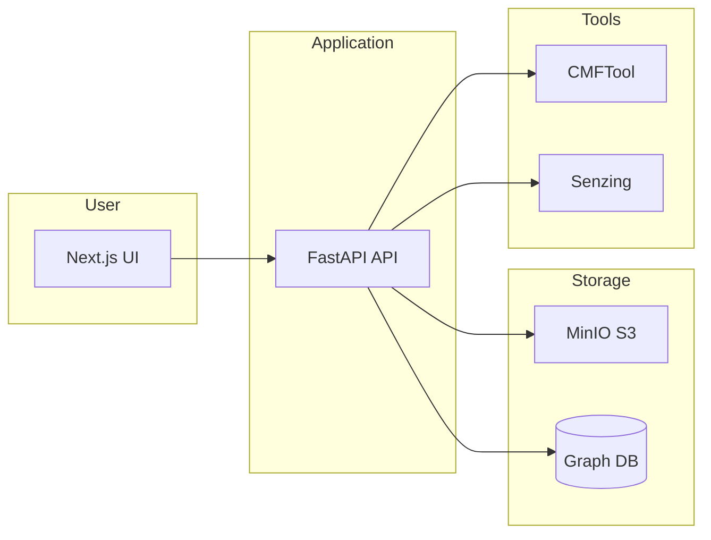

# NIEM Info Exchange: Architecture Interpretation and Expansion Plan

**Created:** 2026-03-04
**Status:** In Progress

---

## 1. Architecture interpretation

The system is a **lightweight containerized pipeline**: UI → API → graph DB + object storage + NIEM/entity-resolution tools. All graph and file I/O go through a small set of touchpoints, which makes expansion and a DB swap manageable.

### High-level flow

### Where each concern lives

| Concern | Primary location | Notes |
|--------|------------------|--------|
| **Schema handling** | `api/src/niem_api/handlers/schema.py`, `api/src/niem_api/services/domain/schema/` | Upload → CMF → mapping.yaml; one "active" schema; designs stored per schema_id in MinIO |
| **Graph model** | `api/src/niem_api/services/domain/schema/mapping.py`, `docs/INGESTION_AND_MAPPING.md` | mapping.yaml drives node labels, relationships, flattening; schema designer produces selections → mapping |
| **Upload / ingest** | `api/src/niem_api/handlers/ingest.py` | XML/JSON: validate → converter → Cypher → Neo4j; multiple files in one request but **sequential** loop, no semaphore (ADR-001 "Partial") |
| **Graph DB access** | `api/src/niem_api/clients/neo4j_client.py`, `api/src/niem_api/core/dependencies.py` | Single global Neo4j client; all Cypher runs via `Neo4jClient.query()` / `query_graph()` / driver `session.run()` |
| **Batch policy** | `docs/adr/001-batch-processing-architecture.md`, `api/src/niem_api/core/config.py` | Semaphore + limits for convert; ingest/schema have limits but **no semaphore** yet |

### Layered API pattern (from ARCHITECTURE.md)

- **Routes** (`api/src/niem_api/main.py`): thin; delegate to handlers.
- **Handlers** (e.g. `ingest.py`, `schema.py`, `graph.py`): orchestrate services and clients; no direct DB/S3 logic.
- **Services + clients**: business logic and external I/O (Neo4j, MinIO, CMF, Senzing).

Keeping this layering will keep schema, batch, and DB changes localized.

---

## 2. Expansion areas (aligned with goals)

### 2.1 More schema files and tinkering

**Current:** One active schema; schemas stored by `schema_id` in MinIO (`niem-schemas/{schema_id}/...`). Upload supports multiple XSDs as one "schema set."

**To expand:**

- **Multi-schema UX**: Schema list and activation already exist; add UI to compare schemas, switch context, and optionally "schema sets" (e.g. family of IEPDs) without changing core storage.
- **More schemas**: Raise or make configurable `BATCH_MAX_SCHEMA_FILES` (currently 50 in `config.py`); ensure schema upload uses the same batch semaphore as in ADR-001.
- **Tinkering**: Keep schema designer and mapping regeneration as-is; optional "copy schema" (clone schema_id and designs) for experimenting without losing the original.

**Key files:** `api/src/niem_api/handlers/schema.py`, schema handlers in `main.py`, UI schema pages.

---

### 2.2 Richer graph data modeling

**Current:** `mapping.yaml` (objects, associations, scalar_props, references) + schema designer (selections → which elements become nodes/edges). Flattening and NIEM patterns are in `docs/GRAPH_SCHEMA.md` and `docs/adr/002-graph-schema-design-flattening-strategy.md`.

**To expand:**

- **Modeling**: Extend mapping spec (e.g. computed properties, optional indexes, relationship properties) in `api/src/niem_api/services/domain/schema/mapping.py` and in the converters that read it (`xml_to_graph/converter.py`, `json_to_graph/converter.py`).
- **Schema designer**: Expose more element metadata (types, associations) and allow saving multiple "designs" per schema (e.g. "minimal" vs "full") with a design name.
- **Graph schema manager**: `api/src/niem_api/services/domain/graph/schema_manager.py` already creates indexes/constraints; align any new modeling features with this (e.g. index hints in mapping).

**Key files:** `mapping.py`, both converters, `xsd_schema_designer.py`, `schema_manager.py`.

---

### 2.3 Batch upload improvements

**Current:** Ingest accepts multiple files but processes them **sequentially** in a loop; no `asyncio.Semaphore` and no per-batch concurrency limit. ADR-001 defines the desired pattern (semaphore, timeouts, per-file error isolation).

**To expand:**

- **Apply ADR-001 to ingest**: In `ingest.py`, use the same `BatchConfig` and a shared semaphore; process files with `asyncio.gather(process_single_file(...))` (or equivalent) so a few files run concurrently without exhausting resources. Keep per-file validation and Cypher execution; aggregate results as today.
- **Optional async batch jobs**: For "batch upload and forget," add a simple job queue (e.g. in-memory or Redis) and a job status endpoint; ingest runs in a worker, returns job_id immediately. Not required for "better batch" but useful for large batches and aligns with BACKLOG P3 (e.g. rate limiting with Redis).
- **Progress and limits**: Expose batch limits in API/UI; optionally add a progress callback or server-sent events for long-running batches.

**Key files:** `api/src/niem_api/handlers/ingest.py`, `api/src/niem_api/core/config.py`, convert handler if it still doesn't use semaphore.

---

### 2.4 Making the system faster

**Current:** Sequential ingest; one transaction per file; single global Neo4j client; schema/mapping fetched from MinIO per request.

**Improvements:**

- **Concurrency**: Apply semaphore-controlled parallel file processing for ingest (and schema upload if not already) so multiple small files run in parallel.
- **Neo4j**: Use connection pooling (Neo4j driver default); for bulk ingest, consider batching Cypher statements (e.g. UNWIND) per file or per batch instead of many small transactions.
- **Caching**: Cache mapping.yaml and possibly CMF/element-tree per schema_id in memory (with TTL or invalidation on schema update) to avoid repeated MinIO round-trips.
- **Validation**: Run validation (XSD/JSON) in parallel with other files when using concurrent ingest; keep validation strict.

**Key files:** `ingest.py` (concurrency + batching), `neo4j_client.py` or new service (bulk run), schema/ingest handlers (caching layer or cache in handlers).

---

## 3. Changing the graph database (TuringDB / LadybugDB)

**Current:** All graph access goes through `api/src/niem_api/clients/neo4j_client.py` (Neo4j driver; `session.run(cypher, params)`). Call sites: ingest (execute Cypher), graph handler (query + query_graph), entity resolution, admin (reset, stats), schema_manager (indexes/constraints), settings_service.

**Strategy: abstract the graph backend**

Introduce a **graph client interface** and keep Cypher as the common language so most of the app stays unchanged. Implement one backend for Neo4j and, when you choose, one for TuringDB or LadybugDB.

### 3.1 Interface shape (recommended)

- **Execute Cypher** (with params) → list of records (e.g. list of dicts).
- **Execute Cypher and return graph** (nodes + relationships + metadata) for visualization.
- **Schema/metadata**: list labels, relationship types; optionally create/drop indexes and constraints.
- **Transaction**: run multiple statements in one transaction (for ingest).

Neo4j client already does all of this; TuringDB and LadybugDB support Cypher (TuringDB: subset; LadybugDB: OpenCypher). Map their APIs to this interface.

### 3.2 Implementation steps

1. **Define interface** (e.g. `GraphClient` or `GraphBackend` protocol) in `api/src/niem_api/clients/` with methods: `query()`, `query_graph()`, `get_schema()`, `get_stats()`, `run_transaction(statements)`, and optionally `close()`. Keep `neo4j_client.py` as the default implementation of that interface.
2. **Dependency injection**: In `dependencies.py`, choose implementation from config (e.g. `GRAPH_BACKEND=neo4j|turingdb|ladybug`); return the interface type so handlers and services depend on the abstraction, not Neo4j.
3. **Replace direct Neo4j usage**: Ensure every caller (ingest, graph, entity_resolution, admin, schema_manager, settings_service) uses the injected client interface. `_execute_cypher_statements` in ingest should call `client.run_transaction(statements)` (or equivalent) instead of `neo4j_client.driver.session()`.
4. **Add TuringDB/LadybugDB adapters**: Implement the same interface for the chosen provider(s). TuringDB: Python SDK + Cypher subset (verify CREATE/MERGE, UNWIND, MATCH, CALL for schema). LadybugDB: `real_ladybug` Python API; confirm Cypher and transaction semantics match (e.g. multi-statement transactions).
5. **Docker and config**: Add optional compose profiles or services for TuringDB or LadybugDB; document connection settings and any Cypher compatibility differences (e.g. TuringDB subset) in README or `docs/INTEGRATIONS.md`.

### 3.3 Compatibility notes

- **TuringDB**: Cypher subset; confirm coverage for: CREATE/MERGE nodes and relationships, UNWIND, MATCH, RETURN, and procedures used for schema (e.g. `db.labels()`). If procedures differ, implement `get_schema()` with TuringDB's own API.
- **LadybugDB**: Embedded or server; Cypher and Python API. Check transaction semantics and whether "run multiple statements" matches current ingest behavior (single transaction, rollback on failure).

### 3.4 Addendum: Why the Graph client abstraction (workplan readme)

This section explains why the Graph client abstraction task is worth doing — what is wrong today and what the abstraction unlocks.

**The problem: Neo4j is hardwired everywhere**

Today the Neo4j driver is not just used in one place; it leaks through the layers in ways that make swapping or testing painful.

1. **Direct driver access bypasses the client**  
   The ingest handler reaches through `Neo4jClient` to use the raw driver: `neo4j_client.driver.session()` and `session.begin_transaction()`. That couples ingest to Neo4j's `Session` and `Transaction` API. If you swap to LadybugDB or TuringDB, this code breaks even if they speak Cypher, because they have different session/transaction APIs (e.g. LadybugDB uses `Connection.execute()`).

2. **The client is imported by name, not by interface**  
   Consumers use `get_neo4j_client()` or instantiate `Neo4jClient()` directly (e.g. ingest creates its own `Neo4jClient()`). There is no shared contract. To try another backend you would have to find every `Neo4jClient()` and every `.driver.session()` call and rewrite them.

3. **Schema manager uses Neo4j-specific procedures**  
   Code calls `SHOW INDEXES`, `SHOW CONSTRAINTS`, `DROP INDEX`, `DROP CONSTRAINT` — Neo4j admin commands, not standard Cypher. Other backends may not support these or use different syntax. Without an abstraction, that admin logic is scattered with no single place to adapt it.

**What the abstraction gives you**

- **Swap databases by changing one config value**  
  With a `GraphClient` protocol and a factory in `dependencies.py` keyed on `GRAPH_BACKEND=neo4j|turingdb|ladybug`, you change the backend via environment variable. Handlers, services, and tests get the right client automatically.

- **Transaction semantics in one place**  
  The raw `driver.session() → begin_transaction() → tx.run()` pattern becomes a single `client.run_transaction(statements)`. Each backend implements transactions internally; callers stay backend-agnostic.

- **Testability without a running database**  
  With a protocol, you can inject an in-memory fake that records Cypher and returns canned results. No need to mock Neo4j driver internals in tests.

- **Isolate compatibility gaps**  
  TuringDB's Cypher subset or missing `CALL db.labels()` can be handled in one adapter (e.g. `get_schema()` using TuringDB's own API). Compatibility stays in backend modules, not in handlers or services.

- **Future-proof the rest of the work**  
  Batch upload, performance, and graph modeling all generate and execute Cypher. Doing the abstraction first keeps that new code backend-agnostic from the start.

---

## 4. How this fits with BACKLOG.md

BACKLOG.md focuses on **production readiness** (license, SECURITY.md, auth, RBAC, audit, rate limiting, backups, etc.). This expansion work is **additive**:

- **Schema/upload/graph modeling**: Independent of P0-P3; can be done in parallel or before/after.
- **Batch and performance**: Complements P1.4 (rate limiting) and P2.2 (metrics); use the same config/env style as in BACKLOG.
- **Graph DB swap**: Eases P2.7 (backups) if the new backend has better backup story; otherwise treat as a separate track. Keep BACKLOG items that assume "Neo4j" generic (e.g. "graph DB backup") once the abstraction is in place.

No need to re-prioritize BACKLOG unless explicitly desired (e.g. do DB abstraction before adding more backup automation).

---

## 5. Work items and order

These expansion items have been incorporated into the **Unified SDLC Roadmap** alongside BACKLOG production-readiness items. See [UNIFIED_SDLC_ROADMAP.md](UNIFIED_SDLC_ROADMAP.md) for the full sequenced plan, and [ROADMAP_STATUS.md](ROADMAP_STATUS.md) for live tracking.

| # | Work item | Roadmap feature | Status | Description |
|---|-----------|-----------------|--------|-------------|
| 1 | Graph client abstraction | F2 | Not started | Interface + Neo4j implementation + DI; refactor call sites. Unblocks DB swap. |
| 2 | Batch upload | F3 | Not started | Apply ADR-001 to ingest (semaphore, optional parallelism); optional progress/job endpoint. |
| 3 | Performance | F4 | Not started | Caching for mapping/schema; bulk Cypher (UNWIND); concurrent file processing. |
| 4 | Schema tinkering | F5 | Not started | Multi-schema UX, configurable schema limits, optional "copy schema." |
| 5 | Graph modeling | F6 | Not started | Extend mapping and schema designer as needed. |
| 6 | New DB provider | F19 | Not started | Implement TuringDB or LadybugDB adapter against the interface; add compose and docs. |

This order lets you swap or compare databases early and then iterate on schema, batch, and performance without touching DB-specific code again.

---

## 6. Planning activity summary (fast-track context for next agent)

This section records what planning has been completed so the next agent (or session) can resume without re-deriving context.

### What was done

- **Architecture interpretation** (sections 1–2 above): Where schema, graph model, ingest, and graph DB access live; expansion areas for schemas, modeling, batch, performance.
- **Graph DB swap strategy** (section 3): Abstract `GraphClient` interface; why it matters (section 3.4 addendum); implementation steps and compatibility notes for TuringDB/LadybugDB.
- **Unified SDLC roadmap**: Expansion features (F2, F3–F6, F19) were merged with BACKLOG production-readiness (F1, F7–F18, F20) into a single **Plan -> Design -> Build -> Test -> Deploy** roadmap with validation at each step. Each feature is delivered in isolation; execute one feature at a time.

### Where everything lives (`development/`)

| Artifact | Purpose |
|----------|---------|
| **EXPANSION_PLAN.md** (this file) | Architecture interpretation, expansion areas, graph DB strategy, addendum, work items; **start here for context**. |
| **UNIFIED_SDLC_ROADMAP.md** | Full 20-feature list (F1–F20) by tier; scope, dependencies, SDLC phases, and validation per feature; dependency graph; execution model. |
| **ROADMAP_STATUS.md** | At-a-glance table: current phase (Plan/Design/Build/Test/Deploy/Done) and feature file link for each of F1–F20. Update as features progress. |
| **templates/FEATURE_TEMPLATE.md** | Reusable 5-phase checklist. Copy into `features/` when starting a new feature. |
| **features/F01-code-of-conduct.md** | F1 (CODE_OF_CONDUCT, P0.3): scope, acceptance criteria, design notes; ready for first SDLC run. |
| **features/F02-graph-client-abstraction.md** | F2 (Graph client abstraction): scope, call sites to refactor, risks, design decisions; ready for next iteration after F1. |

### How to pick up work

1. **Read this file** (sections 1–5) for architecture and expansion rationale.
2. **Open [UNIFIED_SDLC_ROADMAP.md](UNIFIED_SDLC_ROADMAP.md)** for the full feature list, order, and dependencies.
3. **Check [ROADMAP_STATUS.md](ROADMAP_STATUS.md)** to see which feature is current and its phase.
4. **Open the feature file** (e.g. `features/F01-code-of-conduct.md` or `features/F02-graph-client-abstraction.md`) and work through Plan -> Design -> Build -> Test -> Deploy, checking off validation criteria.
5. **Update ROADMAP_STATUS.md** when a feature moves to the next phase or is Done.
6. For **F3–F20** that don’t yet have a feature file: copy `templates/FEATURE_TEMPLATE.md` to `features/F0N-short-name.md`, fill in scope and criteria from UNIFIED_SDLC_ROADMAP.md (and BACKLOG.md where applicable), then run the five phases.

### Suggested order (first few features)

- **F1** (CODE_OF_CONDUCT): No dependencies; good first SDLC run; single file + CONTRIBUTING link.
- **F2** (Graph client abstraction): No dependencies; unblocks F4, F6, F16, F17, F19; see section 3 and 3.4 above and `features/F02-graph-client-abstraction.md` for full scope.
- **F3** (Batch upload): Optional F2; apply ADR-001 to ingest (semaphore, concurrency, timeouts).
- Then F4–F6 (performance, schema tinkering, graph modeling) or F7–F10 (TLS, secrets, security scans, health) depending on priority; F11+ follow BACKLOG chain (F8 -> F11 -> F12, F13, F14; F13 -> F20).

### Related docs (outside `development/`)

- **BACKLOG.md** (repo root): P0–P3 production-readiness items with acceptance criteria and effort.
- **docs/adr/001-batch-processing-architecture.md**: Batch semaphore, limits, timeouts; ingest/schema to align.
- **ARCHITECTURE.md** (repo root): System components, layered API, data flow, technology stack.
