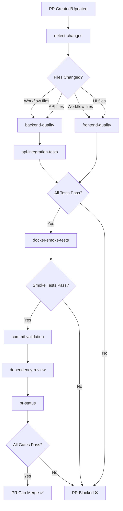
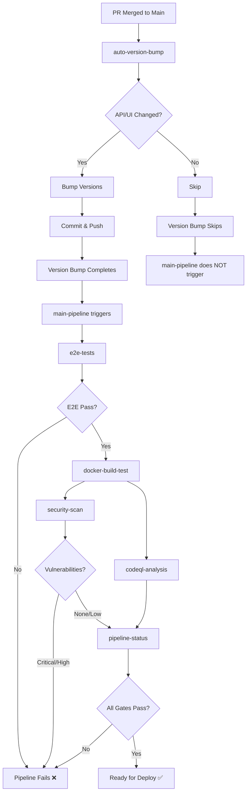

# CI/CD Pipeline Architecture

**Comprehensive guide to the continuous integration and deployment pipelines**

This document describes the CI/CD pipeline design, execution flow, test strategy, and architectural decisions made to ensure code quality, security, and reliable deployments.

---

## Table of Contents

1. [Pipeline Overview](#pipeline-overview)
2. [Architectural Decisions](#architectural-decisions)
3. [Pipeline Execution Flow](#pipeline-execution-flow)
4. [Test Strategy](#test-strategy)
5. [Quality Gates](#quality-gates)
6. [Version Management](#version-management)
7. [Troubleshooting](#troubleshooting)
8. [Future Improvements](#future-improvements)

---

## Pipeline Overview

The CI/CD system consists of three main workflows:

| Workflow | Trigger | Purpose | Duration |
|----------|---------|---------|----------|
| **PR Checks** | Pull requests to main/develop | Fast feedback on code quality, tests, and build | ~5-10 min |
| **Auto Version Bump** | Push to main | Automatically bump semantic versions | ~30 sec |
| **Main Pipeline** | After version bump completes | Full E2E validation, security scanning, deployment prep | ~10-15 min |

### Design Goals

1. **Fast Feedback**: PRs get quality feedback in <10 minutes
2. **Comprehensive Validation**: Main branch validated with E2E tests
3. **No Redundant Tests**: Tests run once, in the right place
4. **Correct Versions**: Docker images always built with accurate version metadata
5. **Security First**: Vulnerability scanning blocks deployments
6. **Cost Efficient**: Conditional job execution saves CI minutes

---

## Architectural Decisions

### Decision 1: Split Test Execution Between PR and Main

**Context**: Running all tests on every PR is slow and expensive. Running no tests on main is risky.

**Decision**:
- **PR Checks**: Unit tests, integration tests, Docker smoke tests (when relevant files change)
- **Main Pipeline**: E2E tests, security scanning, CodeQL analysis

**Rationale**:
- PRs get fast feedback on code correctness (5-10 min)
- Main branch gets comprehensive validation before production
- Integration tests catch database/service issues early (in PR)
- E2E tests validate complete user journeys (on main)
- No redundant test execution

**Consequences**:
- ✅ Faster PR feedback loop
- ✅ Lower CI costs (tests run once, not twice)
- ✅ Better separation of concerns
- ⚠️ E2E failures only caught post-merge (acceptable risk given integration tests in PR)

### Decision 2: Conditional Job Execution with Path Filtering

**Context**: Frontend changes shouldn't trigger backend tests, and vice versa.

**Decision**: Use `dorny/paths-filter@v3` to detect changed files and conditionally run jobs.

**Rationale**:
- GitHub Actions doesn't provide `changed_files` by default
- Path filtering at workflow level (`on.paths`) doesn't work well with multiple jobs
- `paths-filter` action provides reliable outputs that jobs can reference

**Implementation**:
```yaml
detect-changes:
  outputs:
    api: ${{ steps.filter.outputs.api }}
    ui: ${{ steps.filter.outputs.ui }}

backend-quality:
  needs: [detect-changes]
  if: needs.detect-changes.outputs.api == 'true'
```

**Consequences**:
- ✅ Saves ~50% CI minutes on single-component PRs
- ✅ Faster PR checks when only docs/frontend change
- ⚠️ Must keep path patterns in sync with repo structure

### Decision 3: Sequential Version Bump → Main Pipeline

**Context**: Initial design had race conditions where main pipeline ran before version bump, causing Docker images to have incorrect versions.

**Problem**:
```
PR merge → main-pipeline starts (uses v1.2.3)
         → auto-version-bump runs (creates v1.3.0)
         → Docker images tagged with v1.2.3 ❌
```

**Decision**: Use `workflow_run` trigger so main pipeline waits for version bump to complete.

**Implementation**:
```yaml
# main-pipeline.yml
on:
  workflow_run:
    workflows: ["Auto Version Bump"]
    types: [completed]
    branches: [main]
```

**Execution Flow**:
```
1. PR merges → Auto Version Bump runs
2. Auto Version Bump bumps version & commits
3. Auto Version Bump completes (success)
4. Main Pipeline triggers (uses new version)
5. Version bump commit triggers Auto Version Bump again (skips)
6. Main Pipeline does NOT run again (workflow_run success required)
```

**Rationale**:
- Ensures Docker images always have correct version metadata
- No double pipeline runs (saves CI minutes)
- Clear execution order (version → build → test)

**Consequences**:
- ✅ Docker images always correctly versioned
- ✅ No race conditions
- ✅ Pipeline runs once (not twice)
- ⚠️ Main pipeline delayed by ~30 seconds for version bump

### Decision 4: Integration Tests in PR, E2E Tests on Main

**Context**: Where should different test types run?

**Decision**:
- **PR Checks**: Integration tests (Neo4j, MinIO)
- **Main Pipeline**: E2E tests (Playwright, full stack)

**Rationale**:

**Integration Tests (PR)**:
- Validate API services work with real databases
- Catch breaking changes to database queries/storage
- Fast enough for PR feedback (~2-3 min)
- Critical for backend changes

**E2E Tests (Main)**:
- Validate complete user workflows (browser automation)
- Test API + UI + Database together
- Slower (~5-10 min) but comprehensive
- Best suited for post-merge validation

**Consequences**:
- ✅ Integration issues caught in PR (before merge)
- ✅ E2E tests validate complete system on main
- ✅ No redundant test execution
- ⚠️ UI-breaking changes only caught post-merge (mitigated by unit tests)

### Decision 5: Docker Smoke Tests in All PRs

**Context**: Should we build Docker images in PRs or only on main?

**Decision**: Build and smoke test Docker images in all PRs.

**Rationale**:
- Catches Dockerfile issues before merge
- Validates `docker compose up` works
- Ensures version injection works correctly
- Prevents "works locally, breaks in Docker" scenarios

**Cost vs. Benefit**:
- Cost: ~3-5 min per PR, Docker layer caching helps
- Benefit: Prevents broken main branch deployments

**Consequences**:
- ✅ Docker build issues caught in PR
- ✅ Prevents broken deployments
- ⚠️ Adds ~3-5 min to PR checks (acceptable)

---

## Pipeline Execution Flow

### PR Checks Workflow



**Execution Details**:

1. **Detect Changes** (30s)
   - Uses `dorny/paths-filter@v3`
   - Sets outputs: `api`, `ui`, `workflows`

2. **Backend Quality** (3-5 min) - *if API changed*
   - Ruff linter
   - Black formatter check
   - MyPy type checking
   - Bandit security scan
   - Unit tests with coverage
   - Diff-cover check (80%+ on new code)

3. **API Integration Tests** (2-3 min) - *if API changed*
   - Starts Neo4j service container
   - Starts MinIO in Docker
   - Runs pytest integration tests
   - Tests database queries, file storage

4. **Frontend Quality** (3-5 min) - *if UI changed*
   - ESLint (non-blocking temporarily)
   - Prettier format check
   - TypeScript type checking
   - npm audit (high/critical only)
   - Vitest unit tests
   - Build check

5. **Docker Smoke Tests** (5-7 min) - *always*
   - Builds API and UI Docker images
   - Starts all services (docker compose)
   - Tests `/healthz` and `/readyz` endpoints
   - Validates version injection

6. **Commit Validation** (10s) - *non-blocking*
   - Checks conventional commit format
   - Warns if invalid (doesn't block)

7. **Dependency Review** (30s)
   - Scans for new dependencies
   - Blocks high/critical vulnerabilities
   - Blocks GPL-3.0/AGPL-3.0 licenses

8. **PR Status** (10s)
   - Aggregates all job results
   - Passes if all blocking gates succeed
   - Allows skipped jobs (when files didn't change)

### Main Pipeline Workflow



**Execution Details**:

1. **Auto Version Bump** (30s)
   - Detects changed files (API, UI)
   - Determines bump type from commit message
     - `feat:` → minor bump
     - `fix:` → patch bump
     - `BREAKING CHANGE:` → major bump
   - Updates `api/VERSION` and/or `ui/VERSION`
   - Commits: `chore: bump API to X.Y.Z`
   - Pushes (triggers main pipeline)

2. **E2E Tests** (8-12 min)
   - Starts Neo4j service container
   - Starts MinIO in Docker
   - Installs API dependencies
   - Starts API server (uvicorn)
   - Installs UI dependencies
   - Installs Playwright browsers
   - Runs Playwright test suite
   - Uploads videos/screenshots on failure

3. **Docker Build & Smoke Tests** (5-7 min)
   - Builds Docker images with version metadata
   - Starts all services
   - Validates health endpoints
   - Verifies version injection

4. **Security Scan** (2-3 min) - *blocking*
   - Trivy vulnerability scanner
   - Scans code, dependencies, Docker images
   - Blocks on critical/high vulnerabilities
   - Uploads results to GitHub Security

5. **CodeQL Analysis** (5-10 min) - *non-blocking*
   - Deep semantic code analysis
   - Python and JavaScript scans
   - Results tracked in Security tab
   - May have false positives (non-blocking)

6. **Pipeline Status** (10s)
   - Aggregates all results
   - Requires: E2E, Docker, Security to pass
   - CodeQL is informational only

### Version Bump Commit Handling

**Special Case**: When version bump commits are pushed, they trigger Auto Version Bump again.

**Prevention Mechanism**:
```yaml
# auto-version-bump.yml
if: "!contains(github.event.head_commit.message, '[skip ci]') &&
     !startsWith(github.event.head_commit.message, 'chore: bump')"
```

**Flow**:
```
chore: bump API to 1.3.0
  ↓
Auto Version Bump triggered
  ↓
Checks commit message: "chore: bump..."
  ↓
Skips execution (conclusion: skipped)
  ↓
Main Pipeline checks: workflow_run.conclusion == 'success'?
  ↓
No (it was 'skipped'), so Main Pipeline does NOT run
```

**Result**: Version bump commits don't cause infinite loops or double pipeline runs.

---

## Test Strategy

### Test Types and Execution

| Test Type | Location | Runs On | Duration | Purpose |
|-----------|----------|---------|----------|---------|
| **Unit Tests (API)** | `api/tests/unit/` | PR (API changes) | ~30s | Test individual functions/classes |
| **Unit Tests (UI)** | `ui/tests/unit/` | PR (UI changes) | ~3s | Test React components in isolation |
| **Integration Tests** | `api/tests/integration/` | PR (API changes) | ~2-3 min | Test with real Neo4j/MinIO |
| **E2E Tests** | `ui/e2e/` | Main (post-merge) | ~8-12 min | Full user workflows in browser |
| **Smoke Tests** | Docker compose | PR + Main | ~5 min | Validate deployability |

### Test Coverage Requirements

**Backend (Python)**:
- **Overall Coverage**: No strict requirement (legacy code exists)
- **New Code Coverage**: 80%+ (enforced via `diff-cover`)
- **Tool**: pytest with coverage plugin
- **Report**: HTML + XML, uploaded as artifact

**Frontend (TypeScript/React)**:
- **Overall Coverage**: No strict requirement (thin wrappers over libraries)
- **New Code**: Encouraged but not enforced
- **Tool**: Vitest with coverage
- **Report**: HTML, uploaded as artifact

**Why Diff-Cover?**
- Allows incremental improvement without blocking PRs
- Focuses on new code quality
- Doesn't penalize for legacy technical debt
- Encourages developers to test their changes

### When Tests Run

**Fast Feedback (PR Checks)**:
```
Component Changed → Tests Run
─────────────────────────────
api/**              → backend-quality + api-integration-tests
ui/**               → frontend-quality
.github/workflows/** → All tests (workflows might break everything)
docs/**             → None (docs can't break code)
```

**Comprehensive Validation (Main Pipeline)**:
```
Always Runs:
- E2E tests (full stack)
- Docker smoke tests
- Security scanning
- CodeQL analysis
```

### Test Data and Fixtures

**Integration Tests**:
- Neo4j: Started via GitHub service container
- MinIO: Started via Docker run command
- Test data: `api/tests/fixtures/`

**E2E Tests**:
- Full stack: Neo4j + MinIO + API + UI
- Test data: `ui/e2e/fixtures/`
- Page objects: `ui/e2e/page-objects/`

---

## Quality Gates

### PR Quality Gates

**Blocking** (must pass):
- ✅ Backend linting (Ruff, Black)
- ✅ Backend type checking (MyPy)
- ✅ Backend security (Bandit high+ severity)
- ✅ Backend unit tests
- ✅ Backend diff-cover (80%+ on new code)
- ✅ API integration tests (when API changes)
- ✅ Frontend formatting (Prettier)
- ✅ Frontend type checking (TypeScript)
- ✅ Frontend security (npm audit high+ severity)
- ✅ Frontend unit tests
- ✅ Frontend build success
- ✅ Docker smoke tests
- ✅ Dependency review (no critical vulnerabilities, no GPL licenses)

**Non-Blocking** (informational):
- ℹ️ ESLint (temporarily non-blocking, tracked in issue)
- ℹ️ Commit message validation

### Main Branch Quality Gates

**Blocking** (must pass):
- ✅ E2E tests (Playwright)
- ✅ Docker build and smoke tests
- ✅ Security scan (Trivy critical/high vulnerabilities)

**Non-Blocking** (informational):
- ℹ️ CodeQL analysis (tracked in Security tab)

### Security Requirements

**Dependency Vulnerabilities**:
- **Critical/High**: Block PR/deployment
- **Medium/Low**: Warn but don't block
- **Unfixed**: Ignore (no available fix)

**License Restrictions**:
- **Blocked**: GPL-3.0, AGPL-3.0 (copyleft)
- **Allowed**: MIT, Apache-2.0, BSD, ISC

**Security Scanning Tools**:
- Bandit (Python static analysis)
- npm audit (JavaScript dependencies)
- Trivy (Docker images, dependencies, IaC)
- CodeQL (semantic code analysis)
- Dependency Review (GitHub supply chain)

---

## Version Management

### Semantic Versioning

**Format**: `MAJOR.MINOR.PATCH`

**Bump Rules**:
```
Commit Message          → Bump Type
──────────────────────────────────
feat: ...              → MINOR (1.2.3 → 1.3.0)
fix: ...               → PATCH (1.2.3 → 1.2.4)
BREAKING CHANGE: ...   → MAJOR (1.2.3 → 2.0.0)
feat!: ...             → MAJOR (1.2.3 → 2.0.0)
chore/docs/style: ...  → PATCH (default)
```

### Independent Component Versioning

- API and UI have **separate version files**
- Bumped independently based on changed files
- Example: API change → only API version bumps

**Version Files**:
- `api/VERSION` → Injected into Docker image + `/healthz` endpoint
- `ui/VERSION` → Injected into Docker image + build metadata

### Version Injection

**API (Python)**:
```dockerfile
ARG VERSION=unknown
ENV API_VERSION=${VERSION}
```

**Health Endpoint**:
```json
GET /healthz
{
  "status": "healthy",
  "api_version": "1.3.0",
  "timestamp": "2024-10-24T10:30:00Z"
}
```

**Validation**: Smoke tests verify version is not "unknown" or "null"

### Version Bump Edge Cases

**Case 1: Both API and UI change in same commit**
```bash
Commit: feat: add new feature to both API and UI
Result: chore: bump API to 1.3.0 and UI to 2.1.0
```

**Case 2: Only docs/workflows change**
```bash
Commit: docs: update README
Result: No version bump (paths-ignore prevents workflow trigger)
```

**Case 3: Multiple commits in PR**
```bash
PR: feat: A, fix: B, docs: C
Merge commit triggers version bump
Uses most recent conventional commit for bump type
```

---

## Troubleshooting

### PR Checks Failing

**"Backend quality skipped"**
- ✅ Expected if no API files changed
- Check: Did you modify `api/**`?

**"Integration tests failing with connection errors"**
- Check: Neo4j service health
- Check: MinIO startup logs
- Solution: Increase health check timeout

**"Docker smoke tests timeout"**
- Check: Services starting correctly?
- Check: `docker compose logs` output
- Solution: Increase timeout or fix startup issues

**"Diff-cover fails but overall coverage passes"**
- Cause: New code has <80% coverage
- Solution: Add tests for new/changed lines
- Note: Legacy code doesn't affect this check

### Main Pipeline Failing

**"E2E tests not running"**
- Check: Did Auto Version Bump succeed?
- Check: Workflow run trigger conditions
- Cause: Version bump might have skipped

**"E2E tests failing"**
- Check: Playwright videos in artifacts
- Check: Screenshots for visual errors
- Solution: Download artifacts, debug locally

**"Security scan blocking deployment"**
- Check: Trivy results in artifacts
- Check: GitHub Security tab
- Solution: Update vulnerable dependencies

**"CodeQL failing"**
- Note: CodeQL is non-blocking
- Results tracked in Security tab
- May have false positives

### Version Bump Issues

**"Version not bumping"**
- Check: Commit message format
- Check: Did files in `paths-ignore` change?
- Check: Auto Version Bump workflow logs

**"Version bumped twice"**
- Should not happen (fixed in design)
- Check: Workflow run history
- Check: `chore: bump` skip logic

**"Docker images have wrong version"**
- Should not happen (main pipeline waits for bump)
- Check: Workflow run order
- Check: VERSION file in git at build time

### Common Workflow Errors

**"dorny/paths-filter not detecting changes"**
```yaml
# Ensure filters use correct paths
filters: |
  api:
    - 'api/**'  # ✅ Correct
    - api/**    # ❌ Missing quotes
```

**"Job needs dependency error"**
```yaml
needs: [backend-quality, frontend-quality]
if: always() &&  # ✅ Use always() for status checks
    needs.backend-quality.result == 'success'
```

**"workflow_run not triggering"**
- Check: Workflow name matches exactly
- Check: Branch filter matches
- Check: Previous workflow conclusion

---

## Future Improvements

### Short Term

1. **Make ESLint Blocking**
   - Fix existing ESLint errors
   - Remove non-blocking workaround
   - Track in GitHub issue

2. **Add Performance Testing**
   - Lighthouse CI for UI
   - API load testing with k6
   - Track metrics over time

3. **Improve E2E Test Coverage**
   - Add more user workflows
   - Test error scenarios
   - Cross-browser testing (Firefox, Safari)

### Medium Term

1. **Deployment Automation**
   - Auto-deploy to staging on main
   - Manual approval for production
   - Rollback mechanism

2. **Canary Deployments**
   - Gradual rollout
   - Automatic rollback on errors
   - Traffic splitting

3. **Enhanced Security**
   - SAST scanning
   - Container signing
   - SBOM generation

### Long Term

1. **Multi-Environment Testing**
   - Dev → Staging → Production
   - Environment-specific tests
   - Blue/green deployments

2. **Performance Regression Detection**
   - Benchmark tests
   - Automatic alerts on regression
   - Historical trend analysis

3. **Chaos Engineering**
   - Fault injection tests
   - Resilience validation
   - Disaster recovery drills

---

## Related Documentation

- [Unit Testing Guide](UNIT_TESTING.md) - Detailed testing best practices
- [Versioning Strategy](VERSIONING.md) - Version management details
- [API Architecture](API_ARCHITECTURE.md) - Backend structure and patterns
- [Architecture Decision Records](adr/) - Key architectural decisions

---

## Questions or Issues?

1. Check workflow run logs in GitHub Actions
2. Review this documentation
3. Search existing GitHub issues
4. Create new issue with workflow run link

**Last Updated**: 2024-10-24
**Maintained By**: DevOps / Platform Team
