# System Workflows

## Table of Contents

- [Overview](#overview)
- [Workflow 1: Schema Upload](#workflow-1-schema-upload)
- [Workflow 2: XML/JSON Ingestion](#workflow-2-xmljson-ingestion)
- [Workflow 3: Entity Resolution](#workflow-3-entity-resolution)
- [Workflow 4: Schema Designer](#workflow-4-schema-designer)
- [Error Handling Flows](#error-handling-flows)

## Overview

This document provides **sequence diagrams** for the four critical workflows in the NIEM Information Exchange system. These diagrams show the end-to-end flow of data and control through the system components.

### Workflow Summary

| Workflow | Purpose | Key Components | Duration |
|----------|---------|----------------|----------|
| **Schema Upload** | Validate and store NIEM XSD schemas | UI → API → CMFTool → MinIO | 5-30 seconds |
| **Data Ingestion** | Convert XML/JSON to Neo4j graph | UI → API → Converter → Neo4j | 1-60 seconds per file |
| **Entity Resolution** | Find and link duplicate entities | UI → API → Senzing → Neo4j | 10-300 seconds |
| **Schema Designer** | Customize graph structure | UI → API → Element Tree → Mapping | 2-10 seconds |

---

## Workflow 1: Schema Upload

### Purpose

Upload NIEM XSD schema files, validate them using CMFTool and NDR rules, generate Common Model Format (CMF), create default mapping.yaml, and store all artifacts.

### Sequence Diagram

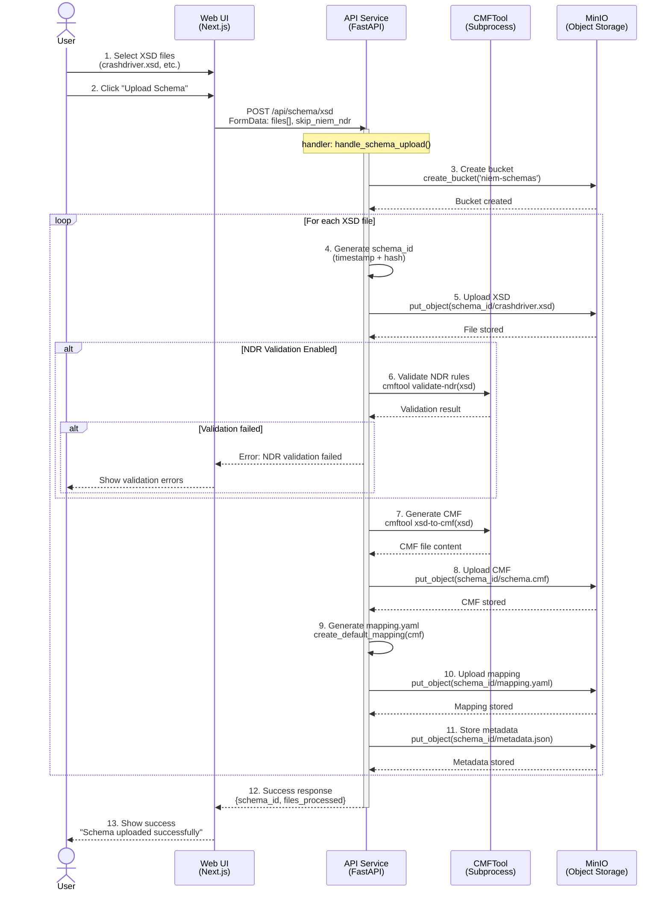

### Key Steps Explained

**Step 4**: Schema ID generation uses timestamp + file hash for uniqueness
```python
schema_id = f"{timestamp}_{file_hash[:8]}"
```

**Step 6**: NDR validation checks NIEM naming and design rules (optional, can be skipped for extensions)

**Step 7**: CMF (Common Model Format) generation converts XSD to intermediate format
- Easier to parse than raw XSD
- Normalizes schema representation

**Step 9**: Default mapping.yaml generation
- Extracts all complex types from CMF
- Marks all as selected by default
- Creates flattened property paths
- Identifies associations

**Step 11**: Metadata includes schema info, upload timestamp, file list

### Error Scenarios

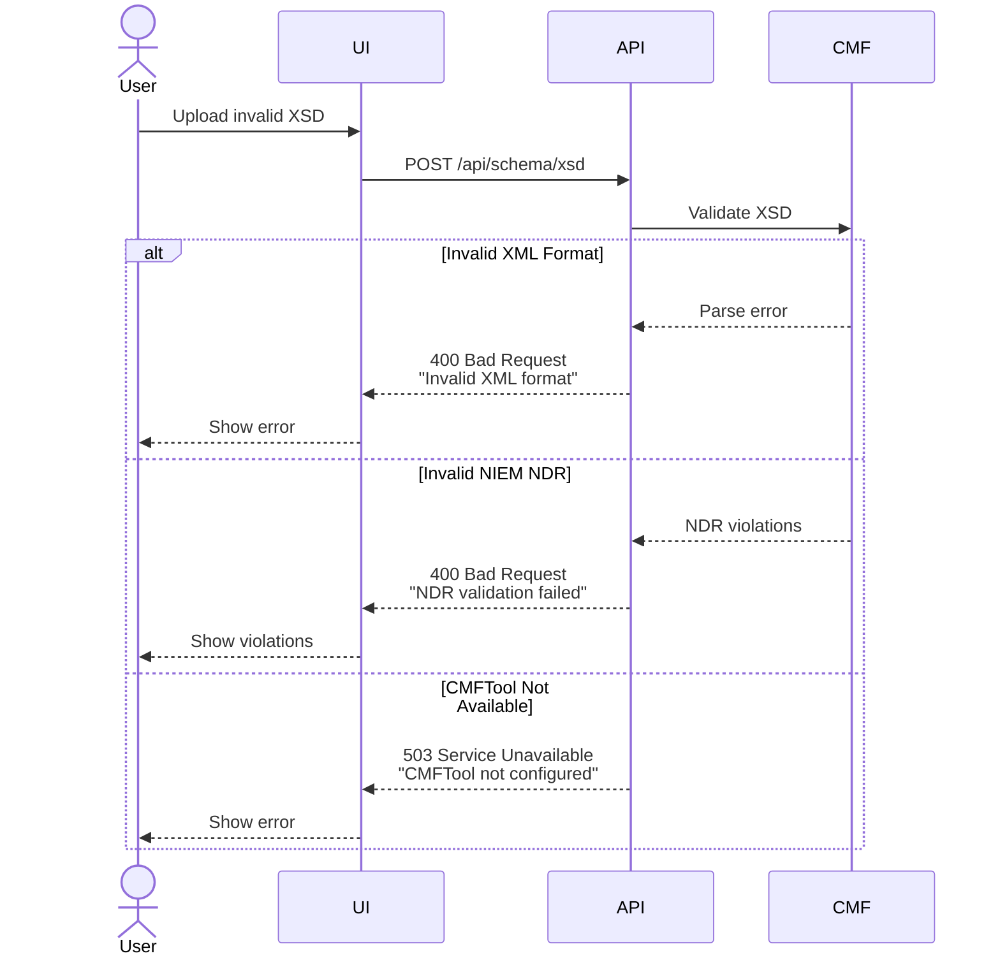

---

## Workflow 2: XML/JSON Ingestion

### Purpose

Validate XML/JSON files against schema, convert to Cypher statements using dual-mode converter, execute in Neo4j to create graph, and store source files.

### Sequence Diagram

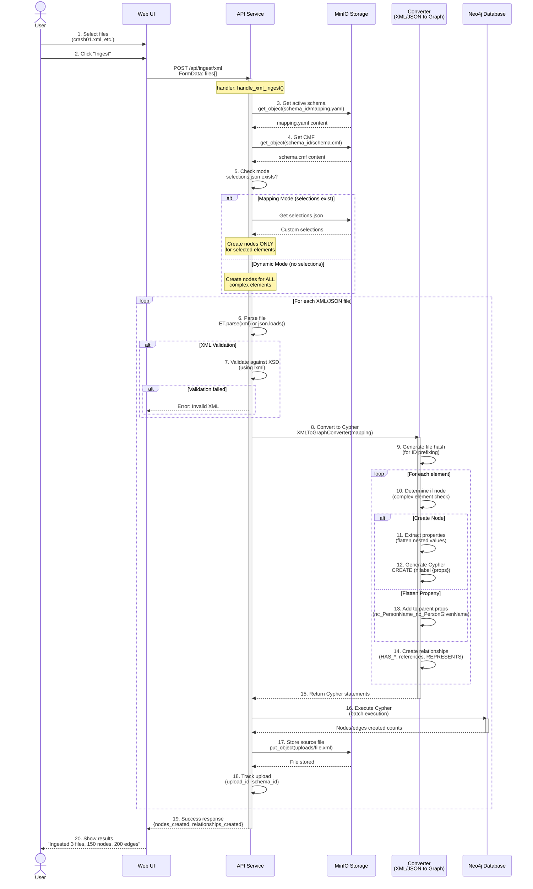

### Key Steps Explained

**Step 5**: Mode detection determines graph structure
- **Mapping Mode**: Only create nodes listed in selections.json
- **Dynamic Mode**: Create nodes for all complex elements (including extensions)

**Step 9**: File hash prefixing prevents ID collisions
```python
file_hash = hashlib.sha256(file_content).hexdigest()[:12]
prefixed_id = f"{file_hash}_{original_id}"
```

**Step 10**: Complex element detection (Dynamic Mode)
```python
is_complex_element = (
    element.has_attribute('structures:id') or
    element.has_attribute('structures:uri') or
    len(element.child_elements) > 0 or
    len(element.attributes) > 1  # More than just xsi:type
)
```

**Step 12**: Property flattening example
```xml
<nc:PersonName>
  <nc:PersonGivenName>John</nc:PersonGivenName>
</nc:PersonName>
```
Becomes: `nc_PersonName_nc_PersonGivenName: 'John'`

**Step 14**: Relationship creation
- HAS_* for containment
- Named references from mapping.yaml
- REPRESENTS for structures:uri links

**Step 16**: Batch Cypher execution (performance optimization)
```python
# Execute in batches of 1000 statements
for batch in chunks(cypher_statements, 1000):
    neo4j.execute_batch(batch)
```

### Dual-Mode Converter Behavior

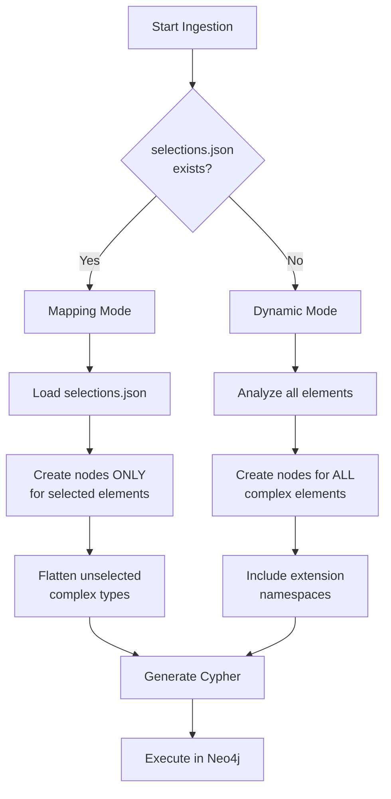

---

## Workflow 3: Entity Resolution

### Purpose

Extract entities from Neo4j graph, detect duplicates using Senzing SDK or text-based matching, create ResolvedEntity cluster nodes, and link duplicates with RESOLVED_TO relationships.

### Sequence Diagram

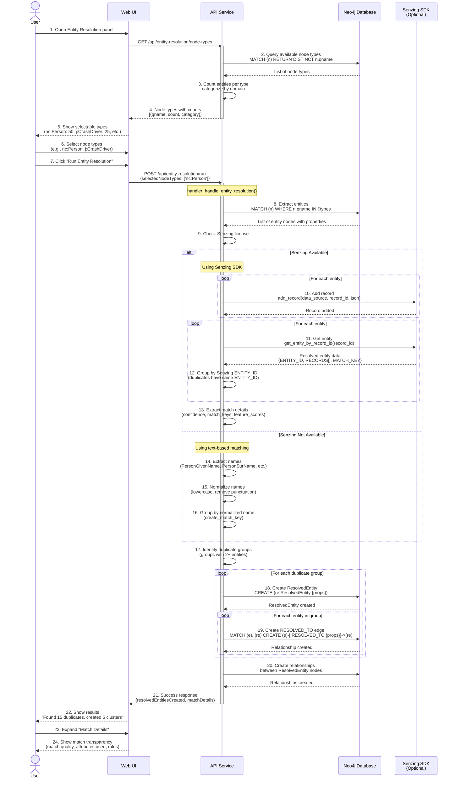

### Key Steps Explained

**Step 8**: Entity extraction query
```cypher
MATCH (entity)
WHERE entity.qname IN $selectedNodeTypes
  AND entity._upload_id IS NOT NULL
RETURN entity
```

**Step 10-11**: Senzing integration (if licensed)
- Converts each entity to Senzing JSON format
- Adds to Senzing engine
- Retrieves resolution results with match details

**Step 12**: Grouping by Senzing ENTITY_ID
```python
resolved_entities = {}
for result in senzing_results:
    senzing_entity_id = result['ENTITY_ID']
    if senzing_entity_id not in resolved_entities:
        resolved_entities[senzing_entity_id] = []
    resolved_entities[senzing_entity_id].append(entity)
```

**Step 14-16**: Text-based fallback (no license)
```python
match_key = f"{given_name.lower()}_{surname.lower()}"
entity_groups[match_key].append(entity)
```

**Step 18**: ResolvedEntity creation
```cypher
CREATE (re:ResolvedEntity {
  entity_id: $entity_id,
  name: $name,
  resolved_count: $count,
  resolution_method: 'senzing',
  confidence: $confidence,
  _upload_ids: $upload_ids,
  _schema_ids: $schema_ids
})
```

**Step 21**: Match details include
- Match quality distribution (high/medium/low confidence)
- Common match keys (which attributes were used)
- Feature scores (attribute quality)
- Resolution rules applied

### Entity Resolution Decision Flow

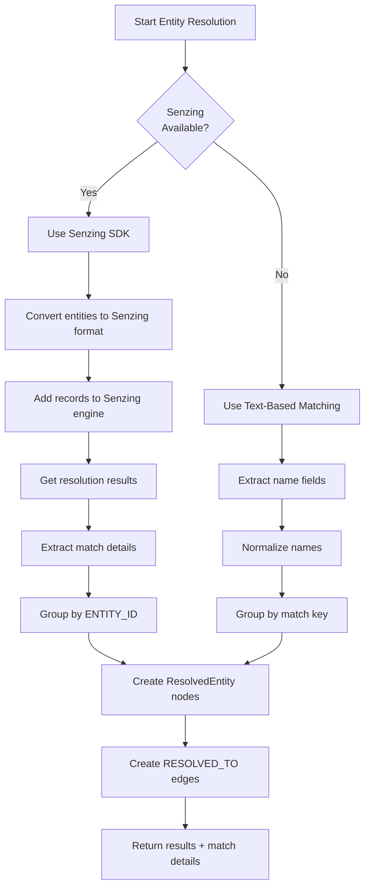

---

## Workflow 4: Schema Designer

### Purpose

Load schema element tree, allow user to select which elements become nodes, generate customized mapping.yaml with flattening rules, and enable mapping mode for subsequent ingestion.

### Sequence Diagram

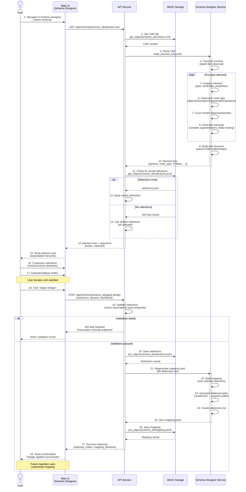

### Key Steps Explained

**Step 4**: Element tree traversal algorithm
```python
def traverse(element, depth=0):
    node = {
        'qname': element.qname,
        'depth': depth,
        'children': []
    }

    for child in element.children:
        child_node = traverse(child, depth + 1)
        node['children'].append(child_node)

    return node
```

**Step 6**: Node type determination
- **object**: Extends structures:ObjectType (can have structures:id)
- **association**: Extends structures:AssociationType
- **augmentation**: Augmentation point elements
- **property**: Simple property wrappers

**Step 12**: Apply saved selections
```python
for node in element_tree:
    node['selected'] = selections.get(node['qname'], True)
```

**Step 19**: Validation rules
- Associations must have at least 2 endpoints selected
- At least 1 element must be selected
- Circular references detected and allowed

**Step 23**: Flattening path generation
```python
# If PersonName NOT selected → flatten
unselected_complex_type = 'nc:PersonName'
parent_path = 'nc:Person'

# Generate flattened path
flattened_properties = [
    f"{parent_path}_nc_PersonGivenName",
    f"{parent_path}_nc_PersonSurName"
]
```

### Schema Designer State Machine

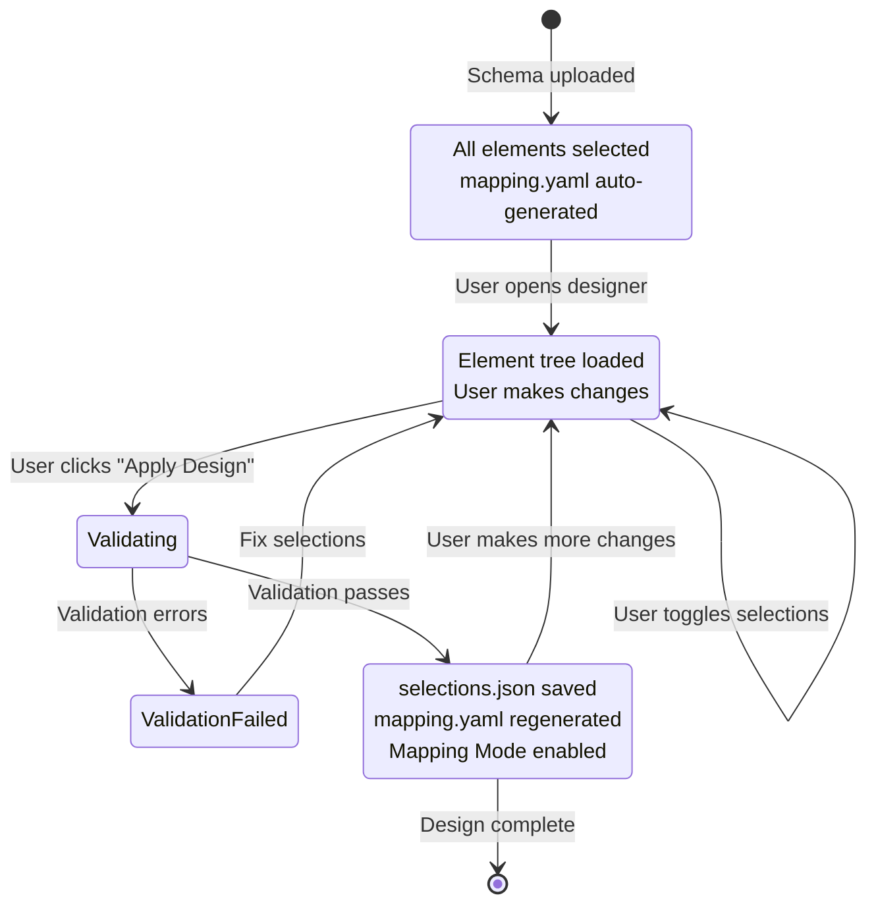

---

## Workflow 5: Graph Query and Visualization

### Purpose

Execute Cypher queries against Neo4j, retrieve graph data, and render interactive visualization.

### Sequence Diagram

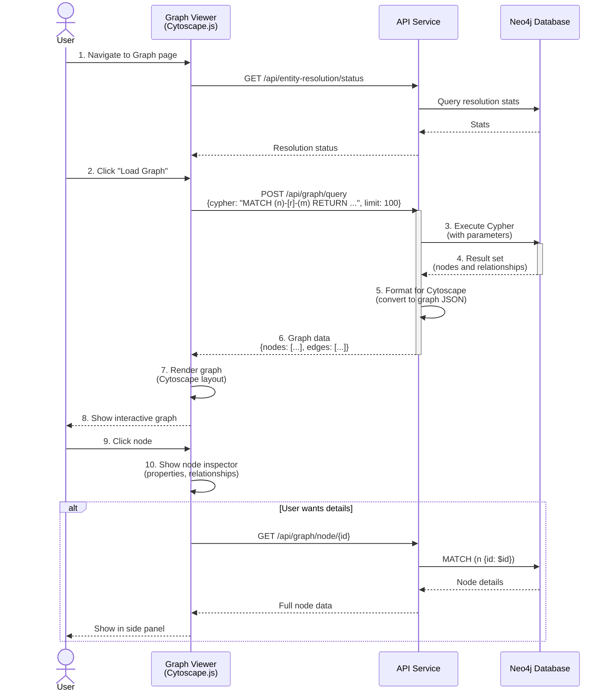

---

## Error Handling Flows

### General Error Handling Pattern

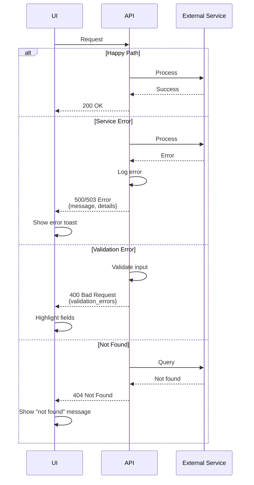

### Retry Logic

For transient failures (Neo4j connection, MinIO timeout):

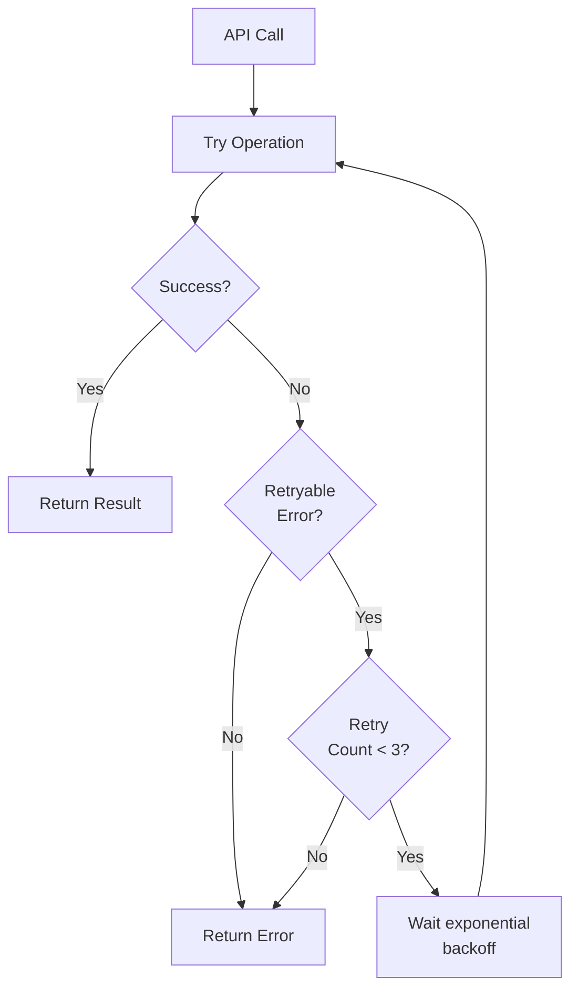

---

## Related Documentation

- **[ARCHITECTURE.md](../ARCHITECTURE.md)** - System architecture overview
- **[GRAPH_SCHEMA.md](GRAPH_SCHEMA.md)** - Neo4j data model and patterns
- **[API_ARCHITECTURE.md](API_ARCHITECTURE.md)** - Detailed API layer design
- **[INGESTION_AND_MAPPING.md](INGESTION_AND_MAPPING.md)** - Data transformation details
- **[schema_designer.md](schema_designer.md)** - Schema designer architecture
- **[senzing-integration.md](senzing-integration.md)** - Entity resolution setup

---

**Last Updated**: 2024-11-08
**Documentation Version**: 1.0
